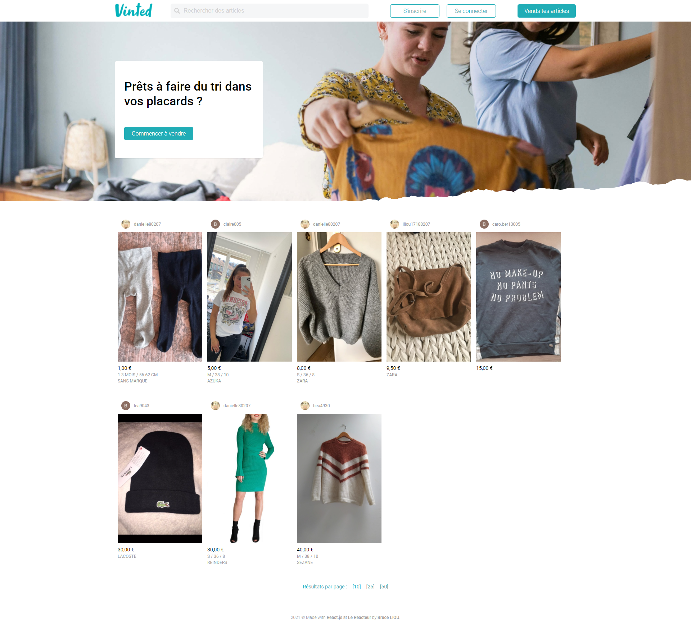
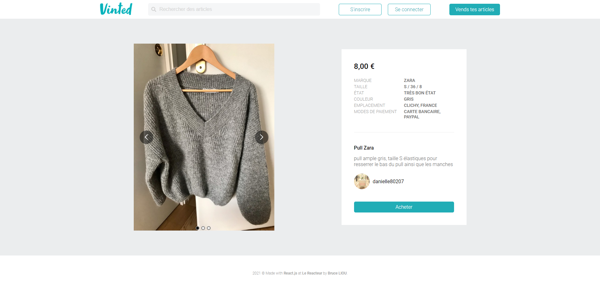

# Vinted Clone - Frontend

<div align="center"><p>This project is based on Vinted, an online marketplace for secondhand clothing.</p>

<br />
<br />
<a href="https://le-reacteur-react-clone-vinted.netlify.app/" target="_blank" rel="noreferrer" >Frontend (Netlify)</a>
<br />
<a href="https://github.com/BruceLIOU/clone-vinted-backend" target="_blank" rel="noreferrer" >Backend repository (Github)</a>
<br />
<br />

</div>

## Stack & Features

Website built with [React JS](https://reactjs.org/) using [Create React App](https://create-react-app.dev/docs/getting-started/) and deployed on Netlify. The backend is developed with Node JS and the database uses Mongo DB cloud-based solution.

_Please note that this project should be viewed on desktop only, it has very basic responsiveness and isn't well suported on mobile devices at the moment._

### Main dependencies

-  Axios (API requests)
-  JS Cookie (cookie management)
-  React Router Dom (navigation)
-  React Multi Carousel (carousel for offer pictures)
-  React Range (to sort offers by price range)
-  Material UI (sorting switch for asc/desc prices)
-  Node Sass (scss)
-  Fontawesome (icons)

### Main features

#### Home page

-  Login and sign up button: open a modal (when the user is logged in the login button turns into a logout button)
-  Search bar: look through the database for offer title matching the input
-  Offer list: display the offers matching the filters (by default price are ascending and 25 result are displayed per page)
-  Page navigation (bottom of the page): navigate through pages and define how many offers are displayed per page

#### Sign up and login

-  Email, username (sign up only) and password are required.
-  Upon submission a cookie with a user token is created. It will be deleted on logout.
-  The password is never saved in the database to ensure maximum security.

#### Publish page

-  User must be logged in to access the publishing form
-  Required fields: picture, title, description, price.
-  Upon submission the user is redirected to the page of the offer.

#### Offer page

-  The page displays the offer details.
-  If the offer has several pictures those will be displayed in a carousel.


## Screenshots

<div align="center">

**Homepage with dynamic search filters:**


<br />
<br />

**Signup modal:**


<br />
<br />

**Offer page:**


<br />
<br />


## Setup Instructions

Clone this repository :

```
git clone https://github.com/BruceLIOU/le-reacteur-react-clone-vinted
```

Install dependencies with yarn:

```
yarn install
```

Once the installation is complete, run it:

```
yarn start
```

## Status & Backlog

✅ This project is complete and functional.

🛠 However, some improvements have been considered for the future:

-  Responsive design
